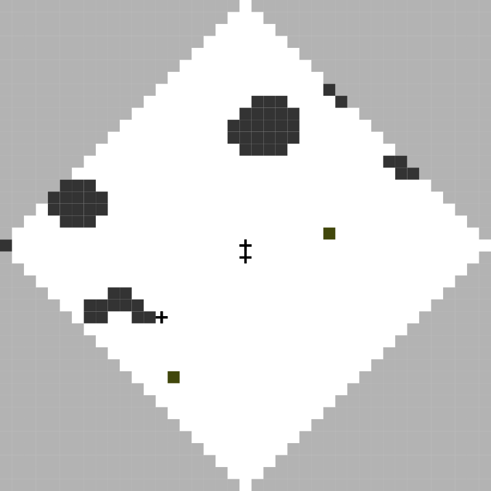

mapc2020
========

A client for the 2020/21 edition of the Multi-Agent Programming Contest.

Example
-------

.. code:: python

    >>> agent = mapc2020.Agent.open("agentA1", "1")

    >>> agent.move("n")

Todo
----

* [ ] Move timeouts one level lower
* [ ] Properly draw agents of different teams
* [ ] Properly draw dispensers
* [ ] Properly draw blocks of different types
* [ ] More robust error handling
* [ ] Handle action results
* [ ] Add example
* [ ] Seamless reconnects
* [ ] Seamless simulation change
* [ ] Finish typing
* [ ] Provide more documentation
* [ ] Testing
